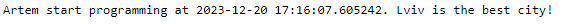

# Звіт до роботи №1
## Тема: Оформлення робіт та перша програма на Python.
### Мета роботи: Навчитись оформлювати роботи з допомогою форматування Markdown та написати першу програму на Python.

---
### Виконання роботи
- Результати виконання завдання:
    1. Створено файл з розширенням `.py` та напитсано першу програму яка знаходиться у файлі [first_app.py](first_app.py);
    1. Результат виконання програми на скріншоті: 
    1. Створили [Python Notebook](first_app.ipynb) та додали пояснення до коду;
    1. В файлі [Python Notebook](first_app.ipynb) вставили відповідь від ChatGPT.
    1. Навчились створювати та запускати програми на Python, працювати в Python Notebook, та за допомогою ChatGPT модифікували нашу першу програму.

---
### Висновок: 
> у висновку потрібно відповісти на запитання:

- :white_check_mark: Що зроблено в роботі: виконали першу програму на Python, попрацювати у Python Notebook, задали запит ChatGPT та оформили звіт;
- :question: Чи досягнуто мети роботи: так :+1:
- :question: Які нові знання отримано: навчились працювати з Python в інтерактивному режимі використовуючи Notebook :notebook: ;
- :question: Чи вдалось відповісти на всі питання задані в ході роботі: так :white_check_mark:
- :question: Чи вдалося виконати всі завдання: так :white_check_mark:
- :question: Чи виникли складності у виконанні завдання: так :white_check_mark:

---
